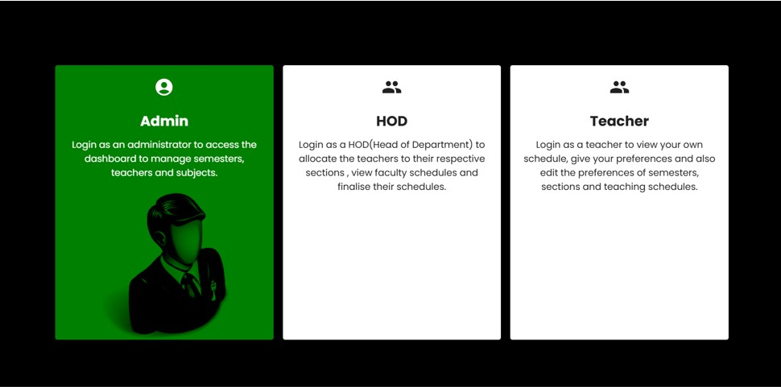
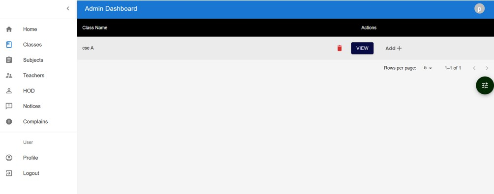
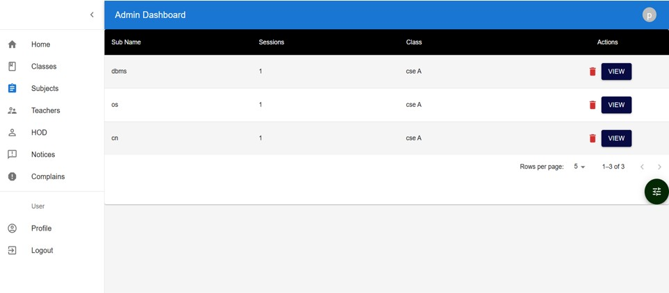
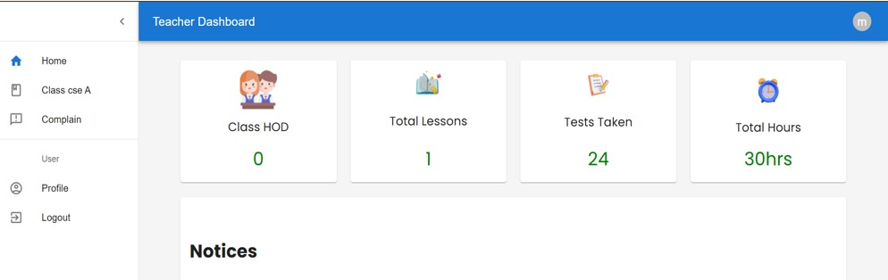

# 📚 SMART EDU - Subject Allocation System

**SMART EDU** is a role-based subject allocation and schedule management system designed for educational institutions. It enables **Admins**, **HODs (Heads of Departments)**, and **Teachers** to collaboratively manage subjects, schedules, preferences, and complaints, ensuring a seamless academic planning process.

---

## 🚀 Live Demo

👉 [Click here to view the live project](https://smart-edu.vercel.app)  
*(Link will be Updated shortly)*

---

## 👥 User Roles & Functionalities

### 👤 Admin
- Secure login to Admin dashboard.
- Add, update, or delete **classes**, **subjects**, and **teachers**.
- Assign HODs, post notices, and manage complaints.
- View and edit all schedules and data.

### 🧑‍🏫 HOD
- Allocate teachers to specific subjects and sections.
- View teacher preferences and finalize their schedules.
- Monitor faculty load and manage timetable distribution.

### 👨‍🏫 Teacher
- Login to access personal dashboard.
- Submit subject and section preferences.
- View allocated schedule, lessons, and hours.
- Access notices and raise complaints if needed.

---

## 🖼️ Screenshots

> 📌 Replace these with actual image files inside your `assets` folder once uploaded.

### 🔸 Role Selection Page


### 🔐 Admin Login Page


### 🧭 Admin Dashboard


### 📚 Subject Management


### 📊 Teacher Dashboard


---

## 🛠️ Tech Stack

| Technology     | Usage                                |
|----------------|---------------------------------------|
| React.js       | Frontend development framework        |
| CSS3           | Styling and layout                    |
| Material UI    | Pre-built UI components               |
| Firebase/      | Authentication                        |
| Vercel         | Deployment platform                   |

---

## 📁 Folder Structure

```
SMART_EDU/
├── public/                         # Static files (index.html, favicon, etc.)
├── src/                            # Main source folder
│   ├── assets/                     # Images and icons
│   ├── components/                 # Reusable UI components
│   ├── pages/                      # Role-based pages (Admin, HOD, Teacher)
│   ├── services/                   # API functions or authentication logic
│   ├── App.js                      # Main app component
│   └── index.js                    # Entry point of the application
├── package.json                    # Project metadata and dependencies
└── README.md                       # Project documentation
```


---

## 🧪 How to Run Locally

1. **Clone the Repository**
   ```bash
   git clone https://github.com/adityaadi03/SMART_EDU.git
   cd SMART_EDU
   ```

2. **Install Dependencies**
   ```bash
   npm install
   ```

3. **Start the Application**
   ```bash
   npm start
   ```


